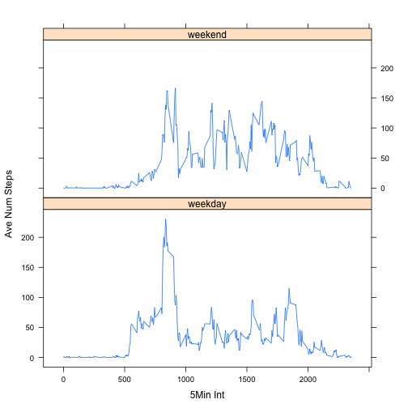

## Set default options and your working directory

```r
opts_chunk$set(echo=TRUE)
opts_chunk$set(warning = FALSE)
setwd("~/R Code/RepData_PeerAssessment1")
library(lattice)
```

## Load the data in a usable form and display a summary of data

```r
RawData <- read.csv("activity.csv",header = TRUE)
summary(RawData)
```

```
##      steps                date          interval     
##  Min.   :  0.00   2012-10-01:  288   Min.   :   0.0  
##  1st Qu.:  0.00   2012-10-02:  288   1st Qu.: 588.8  
##  Median :  0.00   2012-10-03:  288   Median :1177.5  
##  Mean   : 37.38   2012-10-04:  288   Mean   :1177.5  
##  3rd Qu.: 12.00   2012-10-05:  288   3rd Qu.:1766.2  
##  Max.   :806.00   2012-10-06:  288   Max.   :2355.0  
##  NA's   :2304     (Other)   :15840
```


## What is mean total number of steps taken per day across all intervals?


```r
ProcessData <- na.omit(RawData) ## remove NA's
TotalStepsDay <- aggregate(.~date,data=ProcessData,FUN=sum) ## aggregate by date and sum steps
hist(TotalStepsDay$steps, main = "Total Steps Each Day", xlab = "Steps")
```

 

```r
MeanSteps <- mean(TotalStepsDay$steps)
MedianSteps <- median(TotalStepsDay$steps)
```
### The mean number of steps taken is 10766.
### The median number of steps taken is 10765.

## What is the average daily activity pattern?

```r
AveStepsDay <- aggregate(.~interval,data=RawData,FUN=mean) ## find average steps each day for each by 5 minute interval
with(AveStepsDay,plot(interval,steps,type="l"))
title(main="Average Steps Taken per 5 minute Interval",xlab = "5MinInterval",ylab = "Ave Steps")
```

 

```r
MaxIdx <- which.max(AveStepsDay$steps) ## find index of max value
```

### The 835 is the 5 minute interval, on average over all days, that contains the maximum number of steps

## Find and replace the missing values with the average steps taken in that 5 minute interval

```r
IsNA <- is.na(RawData$steps) ## find the missing values
NumNA <- sum(IsNA)  ## count the total number of missing observations
IdxNA <- which(IsNA)
AveStepsInt <- aggregate(.~interval,data=RawData,FUN=mean) ## ave steps for each interval
NewData <- RawData ## newdata has the NA's filled in
## loop over each NA value
for (i in 1:length(IdxNA)) {
    tempIdx <- which(NewData$interval[IdxNA[i]] == AveStepsInt$interval)
    NewData$steps[IdxNA[i]] <- AveStepsInt$steps[tempIdx]
}
## plot filled in data
TotalStepsDay_New <- aggregate(.~date,data=NewData,FUN=sum) ## aggregate by date and sum steps
hist(TotalStepsDay_New$steps, main = "Total Steps Each Day (No NA's)", xlab = "Steps")
```

 

```r
MeanStepsNew <- mean(TotalStepsDay_New$steps)
MedianStepsNew <- median(TotalStepsDay_New$steps)
```
### There are 2304 missing observations.
### The mean number of steps after NA replacement is 10766.
### The median number of steps after NA replacement is 10766.
### The mean after replacement differs by 0.
### The median after replacement differs by -1.

## Determine if there are differences in activity patterns between weekends and weekdays (use the data with NA's filled in)
### Note that Saturday and Sundays are considered weekend days

```r
## first we need to find the day type for each observation
ActualDay <- weekdays(as.Date(NewData$date)) ##extract the actual day
DayType <- rep("weekday",length(ActualDay))
##find weekends and then replace DayType "weekday" with "weekend"
IsSun <- ActualDay == "Sunday"
DayType[IsSun] <- "weekend"
IsSat <- ActualDay == "Saturday"
DayType[IsSat] <- "weekend"
DayType <- factor(DayType)
## append data set with the day type
NewData <- cbind(NewData,DayType)
## average by interval and day type
AveSteps <- aggregate(NewData,list(NewData$interval,NewData$DayType),FUN=mean)
## plot the data
xyplot(steps ~ Group.1 | Group.2, data = AveSteps, layout = c(1,2),type = "l",xlab = "5Min Int", ylab = "Ave Num Steps")
```

 
